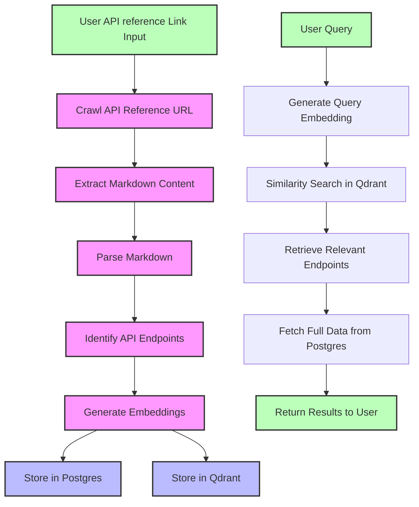
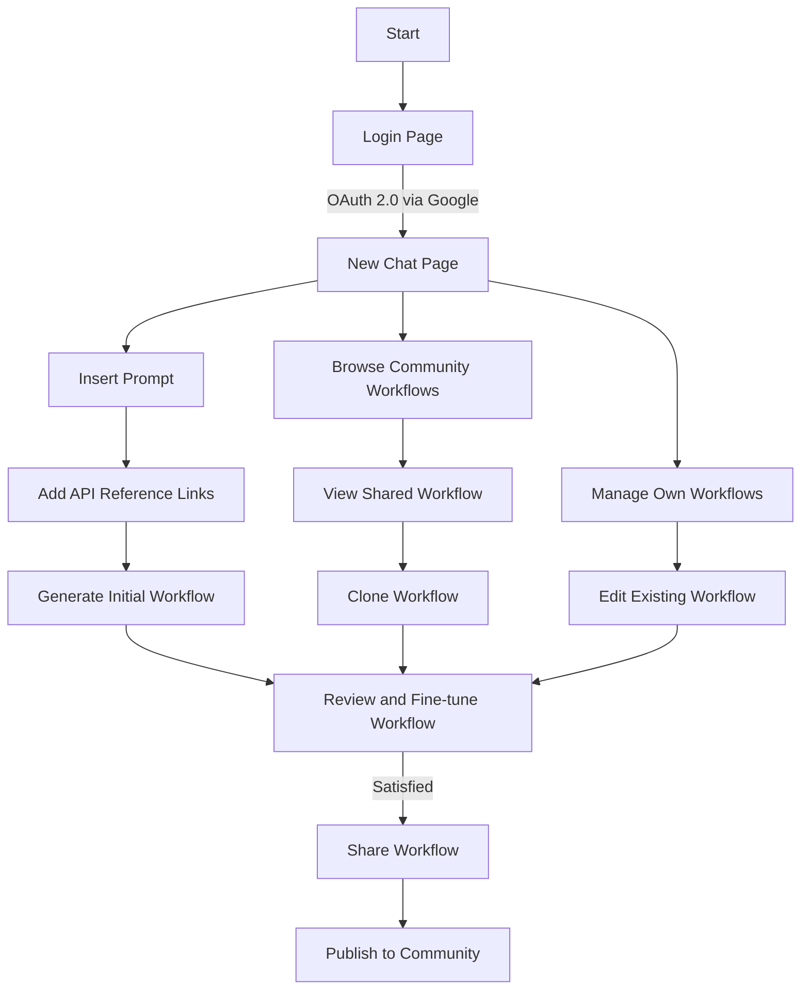
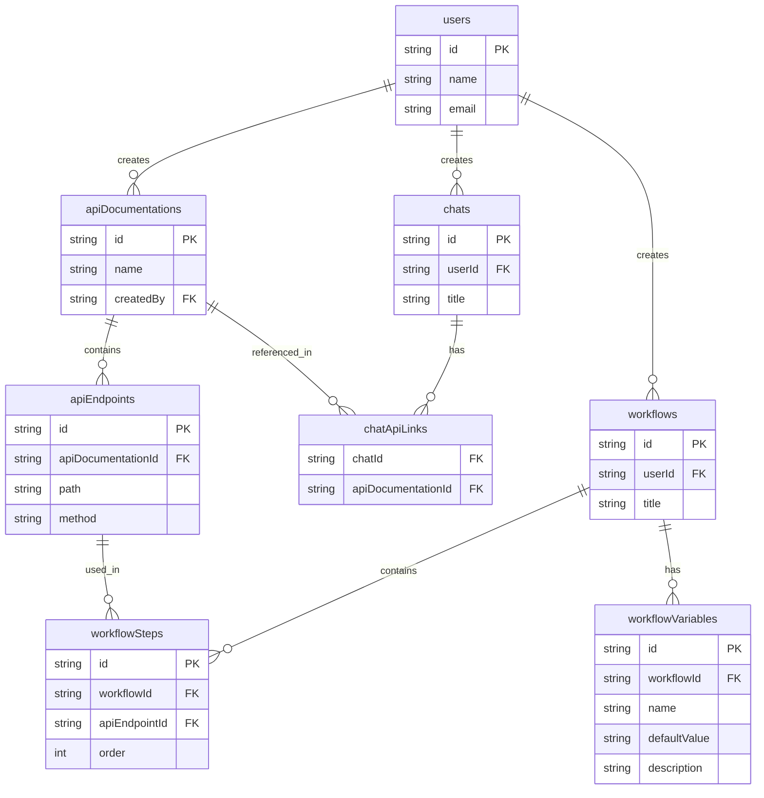
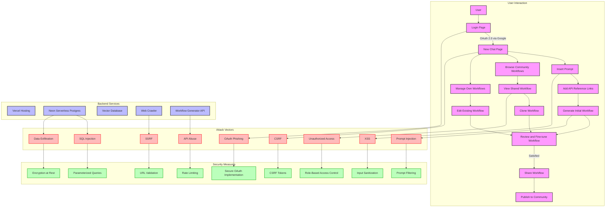

<div align="center">


<h1 style="margin-top: 8px;">2docs</h1>

Generate robust code workflows by integrating two or more API's seamlessly. Works by inserting a descriptive workflow prompt and the links to the API references to be included. Finetune and iterate as needed. Cheap, accurate, and user-friendly.

<div style="display: flex; justify-content: space-around; align-items: center; padding: 10px 0px">
  <table style="border-collapse: collapse; border: none;">
    <tr>
      <td align="center" width="200" style="border: none;">
        <a href="https://docs.2docs.dev">Documentation</a>
      </td>
      <td align="center" width="200" style="border: none;">
        <a href="https://docs.2docs.dev/getting-started">Getting Started</a>
      </td>
      <td align="center" width="200" style="border: none;">
        <a href="https://docs.2docs.dev/examples">API Reference</a>
      </td>
    </tr>
  </table>
</div>
</div>

---

## Table of Contents

- [Who is this useful for?](#who-is-this-useful-for)
  - [User Personas](#user-personas)
  - [User Stories](#user-stories)
- [Usage](#usage)
  - [Web App](#web-app)
  - [API](#api)
  - [Local Usage](#local-usage)
- [Conceptual Guide](#conceptual-guide)
- [Feature Roadmap](#feature-roadmap)
- [Database](#database)
  - [Entity-Relationship Diagram](#entity-relationship-diagram)
  - [PostgreSQL](#postgresql)
  - [Qdrant](#qdrant)
- [Security](#security)
  - [Threat Model](#threat-model)
  - [Cyber Security Measures](#cyber-security-measures)
  - [Current External Dependencies](#current-external-dependencies)
- [Architecture](#architecture)
- [Technologies](#technologies)
- [Possible Contributions](#possible-contributions)

---

## TL;DR

2docs is a tool that generates code workflows by connecting multiple APIs though their references. It crawls API documentation directly for up-to-date accuracy, enabling developers to build integrated systems quickly with full code ownership (no vendor lock-in). Cheap, reliable, accurate. It uses vector embeddings for efficient API endpoint matching.

- It offers three ways to use:
  - Web App: Quick browser-based interface
  - API: Direct endpoint access
  - Local Setup: Full development environment

Built with Next.js/TypeScript, PostgreSQL (Neon Serverless), Qdrant, and Docker.

## Who is this useful for?

The tool aims to simplify the creation of automations with full ownership over the code. Compared to common automation tools it aims to give the developer full control over the generated code while maintaining much lower costs (plus no lock-in effects, you own all the code) and higher accuracy due to frequent crawling of the API references directly.

Some API's change quite frequently. This might take quite some time to be reflected in Integrations of tools like Zapier or Make. Furthermore, 2docs intends to create educational transparency for developers getting started using multiple Application Programming Interfaces. As this is a crucial skill for developers nowadays, the data flows between these interfaces should be playful, easy to grasp, and highly interactive.

<details>
<summary>User Personas</summary>
<br />

- Name: Paul
- Developer skill: Midlevel
- Programming languages: JS/TS
- Developer environment: MacOS, Linux
- Team role: Software Engineer
  <br />
- Name: Lisa
- Developer skill: No-code experience, Web Dev Basics
- Programming languages: JS/TS, Python
- Developer environment: MacOS, Linux
- Team role: Product Manager
</details>

<details>e
<summary>User Stories</summary>

```
”As a developer, I want to implement two or more API's quickly so our product can access 3rd party data to build a better product for our clients.”
```

```
”As a Product Manager, I want to easily understand the requirements on how to integrate different services using custom code to improve our product and automate boring stuff.”
```

</details>
</div>

## How it works



## Usage

Depending on your use case, there's different ways of working with 2docs workflows:

### Web App

The easiest way to use 2docs is via the web app running in the browser. It is currently visible <a href="https://2docs.vercel.app/">here</a>.

### API

Check out the API reference here to call the respective endpoints for workflow generation and retrieve the code.

### Local usage

Follow the instructions below to set up a local development environment for 2docs.

##### Clone the repository

```
git clone https://github.com/paulocerez/2docs.git
```

##### Copy the .env.example file into a .env

```
cp .env.example .env
```

```
AUTH_SECRET=
DATABASE_PASSWORD=
AUTH_DRIZZLE_URL=
AUTH_GOOGLE_ID=
AUTH_GOOGLE_SECRET=
DATABASE_URL=
OPENAI_API_KEY=
QDRANT_URL=http://localhost:6333
```

##### Get the necessary API-Keys

```
Visit and generate an API Key at OpenAI.
```

##### Install the required dependencies

```
npm install
```

##### Run the application locally

```
docker compose up --build
```

## Conceptual Guide

### User Flow



## Feature Roadmap

##### 15-11-2024

Users can start basic chat sessions, crawling entire API references and store these in the Vector Database. The generator then builds a workflow based on the user prompt.

##### 15-12-2024

The workflows are much more accurate. Users can share workflows in an Online Community and retrieve and edit workflows from others.

## Database

### Entity-Relationship Diagram



### PostgreSQL

```
Storing data in tables per entity.
```

| Entity            | Information stored                                  | References               | Referenced By                       | Example                                                                                                                                      |
| ----------------- | --------------------------------------------------- | ------------------------ | ----------------------------------- | -------------------------------------------------------------------------------------------------------------------------------------------- |
| users             | User information                                    | -                        | chats, apiDocumentations, workflows | { id: "user123", name: "John Doe", email: "john@example.com" }                                                                               |
| chats             | Individual chat sessions                            | users                    | chatApiLinks                        | { id: "chat456", userId: "user123", title: "API Integration Chat" }                                                                          |
| apiDocumentations | Metadata about API documentations                   | users (createdBy)        | apiEndpoints, chatApiLinks          | { id: "api789", name: "GitHub API", createdBy: "user123" }                                                                                   |
| apiEndpoints      | Detailed information about individual API endpoints | apiDocumentations        | workflowSteps                       | { id: "endpoint101", apiDocumentationId: "api789", path: "/users", method: "GET" }                                                           |
| chatApiLinks      | Links between chats and API documentations          | chats, apiDocumentations | -                                   | { chatId: "chat456", apiDocumentationId: "api789" }                                                                                          |
| workflows         | User-created workflows                              | users                    | workflowSteps, workflowVariables    | { id: "workflow202", userId: "user123", title: "GitHub Issue Tracker" }                                                                      |
| workflowSteps     | Individual steps within a workflow                  | workflows, apiEndpoints  | -                                   | { id: "step303", workflowId: "workflow202", apiEndpointId: "endpoint101", order: 1 }                                                         |
| workflowVariables | Variables used within workflows                     | workflows                | -                                   | { id: "var404", workflowId: "workflow202", name: "GITHUBAPIKEY", defaultValue: null, description: "Your GitHub API key for authentication" } |

### Qdrant

```
Storing vector embeddings of the scraped API references, performing vector similarity search for efficient endpoint retrieval.
```

| Entity                                | Information stored                            | References | Referenced By | Example                                                                                                                                                             |
| ------------------------------------- | --------------------------------------------- | ---------- | ------------- | ------------------------------------------------------------------------------------------------------------------------------------------------------------------- |
| Vector Embeddings (Qdrant Collection) | Vector embeddings of API documentation chunks | -          | -             | { id: "vec505", vector: [0.1, 0.2, ...], payload: { apiDocumentationId: "api789", apiEndpointId: "endpoint101", content: "This endpoint retrieves user data..." } } |

## Security

The security apporach is highly guided by the STRIDE Model. It clusters potential threats into 6 categories:

| Entry Point            | Explanation                                                   |
| ---------------------- | ------------------------------------------------------------- |
| Spoofing Identity      | Illegal access and usage of credentials                       |
| Tampering with data    | Malicious data modifications (unauthorized, unauthenticated)  |
| Repudiation            | Performing illegal actions that can't be proven by the system |
| Information disclosure | Exposure of discrete information to unauthorized users        |
| Denial of service      | Service unavailability to valid users                         |
| Elevation of privilege | Unauthorized access controls                                  |

### Threat Modeling

During the implementations of security measures, I've been following this Thread Model Process from the OWASP community. This has been helpful in scoping and determining possible threats.

<a href="https://owasp.org/www-community/Threat_Modeling_Process#step-1-scope-your-work">OWASP Threat Modeling Process</a>

The key idea is to look at the application security from the attacker's perspective.



### Cyber security measures

| Entry Point                | Threat                                                     | Mitigation                                                                                | Security Benefit/Urgency Level | Implemented? |
| -------------------------- | ---------------------------------------------------------- | ----------------------------------------------------------------------------------------- | ------------------------------ | ------------ |
| Login                      |                                                            |                                                                                           |                                | ❌           |
|                            |                                                            |                                                                                           |                                | ❌           |
| Login                      |                                                            |                                                                                           |                                | ❌           |
| Prompt Insertion           | Malicious prompt injection                                 | ----------                                                                                | ------------------------------ | ❌           |
| Links insertion            | Malicious URL injection                                    | ----------                                                                                | ------------------------------ | ❌           |
| Creation of chats          | DDOS through too many concurrent requests                  | Rate Limiting -> Freemium Tiers                                                           | ------------------------------ | ✅           |
| Creation of workflows      | DDOS through too many Firecrawl API requests -> High costs | Rate Limiting -> Freemium Tiers                                                           | ------------------------------ | ✅           |
| Creation of messages       | DDOS through too many OpenAI API requests -> High costs    | Rate Limiting -> Freemium Tiers                                                           | ------------------------------ | ✅           |
| Login                      | OAuth Phishing                                             | Implement secure OAuth 2.0 flow, use HTTPS, educate users about secure login practices    | High/Urgent                    | ✅           |
| Login                      | CSRF Attack                                                | Implement CSRF tokens for all forms and state-changing requests                           | High/Urgent                    | ❌           |
| New Chat Page              | XSS (Cross-Site Scripting)                                 | Input sanitization, use of Content Security Policy (CSP) headers                          | High/Urgent                    | ❌           |
| Prompt Insertion           | Malicious prompt injection                                 | Input validation and sanitization, implement prompt filtering                             | Medium/Important               | ❌           |
| Links insertion            | Malicious URL injection                                    | URL validation and sanitization, implement whitelist of allowed domains                   | High/Urgent                    | ❌           |
| Web Crawler                | SSRF (Server-Side Request Forgery)                         | Strict URL validation, whitelist allowed domains, restrict to HTTP/HTTPS protocols        | High/Urgent                    | ❌           |
| API Requests               | API Abuse                                                  | Implement rate limiting, use API keys, monitor for unusual activity                       | Medium/Important               | ✅           |
| Workflow Generation        | Prompt manipulation                                        | Implement safeguards in the workflow generation logic, sanitize inputs                    | Medium/Important               | ❌           |
| Database (Postgres)        | SQL Injection                                              | Use parameterized queries via DrizzleORM, limit database user privileges                  | High/Urgent                    | ✅           |
| Database (Postgres)        | Data Breach                                                | Encrypt sensitive data at rest, use strong access controls                                | High/Urgent                    | ❌           |
| Vector Database (Qdrant)   | Unauthorized Access                                        | Implement proper authentication and authorization for database access                     | Medium/Important               | ✅           |
| Workflow Sharing           | Unauthorized Access                                        | Implement role-based access control (RBAC), verify user permissions before allowing edits | High/Urgent                    | ❌           |
| Workflow Viewing           | Information Leakage                                        | Ensure proper access controls, don't expose unpublished workflows                         | Medium/Important               | ❌           |
| Workflow Cloning           | Unauthorized Cloning                                       | Implement checks to ensure only published workflows can be cloned                         | Low/Consider                   | ❌           |
| API Endpoints              | Insecure Direct Object References (IDOR)                   | Implement proper authorization checks for all API endpoints                               | High/Urgent                    | ❌           |
| All Network Communications | Man-in-the-Middle Attacks                                  | Use HTTPS for all communications, implement HSTS                                          | High/Urgent                    | ✅           |
| User Sessions              | Session Hijacking                                          | Use secure session management practices, implement session timeouts                       | High/Urgent                    | ✅           |
| Error Handling             | Information Disclosure                                     | Implement proper error handling to avoid leaking sensitive information                    | Medium/Important               | ❌           |
| Dependencies               | Known Vulnerabilities                                      | Regularly update and patch all dependencies, use dependency scanning tools                | High/Urgent                    | ✅           |
| Server Configuration       | Misconfiguration                                           | Implement secure server configurations, use security headers                              | Medium/Important               | ❌           |
| Application Logic          | Business Logic Flaws                                       | Conduct thorough code reviews and security audits                                         | Medium/Important               | ❌           |

##### Security on all layers

##### Input Validation/Sanitization

##### Authentication Security

##### Permission/Access control

##### Server-Side Request Forgery

##### Data protection

##### Permission/Access control

### Current external dependencies

Auth.js for OAuth authentication. Google as the Identity Provider for Sign-up and login functionality. Qdrant and Neon Serverless as Database Cloud Services. Firecrawl is used for the crawling procedure.

## Technologies

- Next.js 15 (App Router, TypeScript, TailwindCSS)
- Postgresql (Neon Serverless), Qdrant
- Firecrawl
- Docker

## Possible contributions

- Crawling service: Currently using FireCrawl Cloud as a 3rd-party library for crawling the API references -> Small vendor-lock-in + DOS risks (and high costs)

## Feedback? ✨

For any feedback or suggestions, 💌 me here: paulo.ramirez@code.berlin
