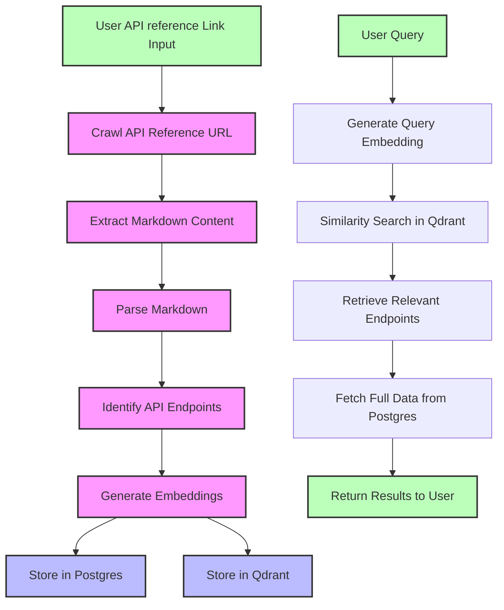
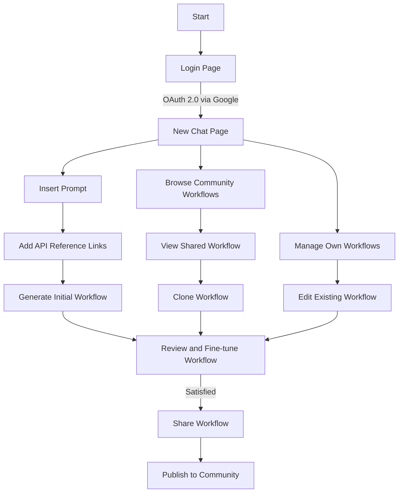
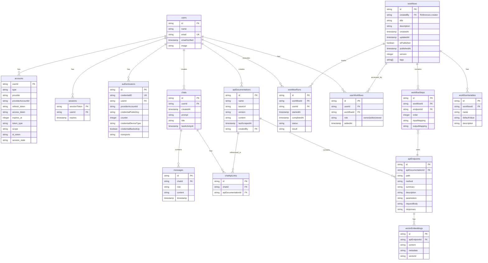
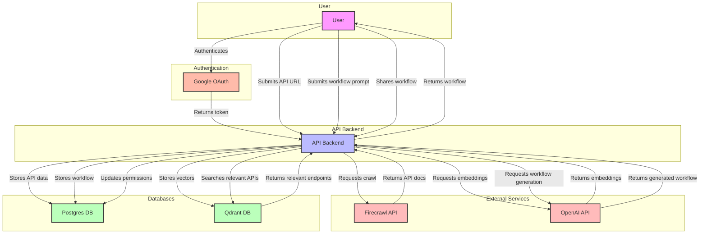

<div align="center">


<h1 style="margin-top: 8px;">2docs</h1>

Generate robust code workflows by integrating two or more API's seamlessly. Works by inserting a descriptive workflow prompt and the links to the API references to be included. Finetune and iterate as needed. Cheap, accurate, and user-friendly.

</div>

---

## Table of Contents

- [TL;DR](#tldr)
- [Who is this useful for?](#who-is-this-useful-for)
  - [User Personas](#user-personas)
  - [User Stories](#user-stories)
- [Example use cases](#example-use-cases)
- [How it works](#how-it-works)
- [Usage](#usage)
  - [Web App](#web-app)
  - [API](#api)
  - [Local usage](#local-usage)
- [Conceptual Guide](#conceptual-guide)
  - [User Flow](#user-flow)
- [Feature Roadmap](#feature-roadmap)
- [Database](#database)
  - [Entity-Relationship Diagram](#entity-relationship-diagram)
  - [PostgreSQL](#postgresql)
  - [Qdrant](#qdrant)
- [Security](#security)
  - [Threat Modeling](#threat-modeling)
  - [Cyber security measures](#cyber-security-measures)
  - [Current external dependencies](#current-external-dependencies)
- [Technologies](#technologies)
- [Possible contributions](#possible-contributions)
- [Feedback](#feedback)

---

## TL;DR

2docs is a tool that generates code workflows by connecting multiple APIs though their references. It crawls API documentation directly for up-to-date accuracy, enabling developers to build integrated systems quickly with full code ownership (no vendor lock-in). Cheap, reliable, accurate. It uses vector embeddings for efficient API endpoint matching.

- It offers three ways to use:
  - Web App: Quick browser-based interface
  - API: Direct endpoint access
  - Local Setup: Full development environment

Built with Next.js/TypeScript, PostgreSQL (Neon Serverless), Qdrant, and Docker.

## Who is this useful for?

The tool aims to simplify the creation of automations with full ownership over the code. Compared to common automation tools it aims to give the developer full control over the generated code while maintaining much lower costs (plus no lock-in effects, you own all the code) and higher accuracy due to frequent crawling of the API references directly.

Some API's change quite frequently. This might take quite some time to be reflected in Integrations of tools like Zapier or Make. Furthermore, 2docs intends to create educational transparency for developers getting started using multiple Application Programming Interfaces. As this is a crucial skill for developers nowadays, the data flows between these interfaces should be playful, easy to grasp, and highly interactive.

<details>
<summary>User Personas</summary>
<br />

- Name: Paul
- Developer skill: Midlevel
- Programming languages: JS/TS
- Developer environment: MacOS, Linux
- Team role: Software Engineer
  <br />
- Name: Lisa
- Developer skill: No-code experience, Web Dev Basics
- Programming languages: JS/TS, Python
- Developer environment: MacOS, Linux
- Team role: Product Manager
</details>

<details>
<summary>User Stories</summary>

```
”As a developer, I want to implement two or more API's quickly so our product can access 3rd party data to build a better product for our clients.”
```

```
”As a Product Manager, I want to easily understand the requirements on how to integrate different services using custom code to improve our product and automate boring stuff.”
```

</details>

## Example use cases

<details>
<summary>Finding recipes with nutrition info</summary>

- Prompt: "Find healthy chicken recipes under 500 calories with at least 30g of proteins."
- APIs: Spoonacular API, Nutritionix API

</details>
<details>
<summary>Movie night planner</summary>

- Prompt: "Suggest a romantic comedy movie and nearby pizza delivery options for tonight."
- APIs: The Movie Database (TMDb) API, Yelp Fusion API

</details>
<details>
<summary>Job Search Aggregator</summary>

- Prompt: "Find software developer jobs in Berlin and provide company details for the top 5 results."
- APIs: Indeed API, Clearbit Company API

</details>
<details>
<summary>Social Media Content Scheduler</summary>

- Prompt: "Create and schedule a tweet about AI technology for next Tuesday at 2 PM, including a relevant image."
- APIs: Buffer API, DALL-E API by OpenAI

</details>
<details>
<summary>Book Recommendation Engine</summary>

- Prompt: "Recommend science fiction books similar to 'Dune' and show their ratings."
- APIs: Google Books API, Goodreads API

</details>
<details>
<summary>Automated Document Generator</summary>

- Prompt: "Create a serverless function that automatically creates and sends out order confirmations for customers that signed a contract and moved into the 'signed' pipeline stage."
- APIs: PandaDoc API, HubSpot API

</details>

## How it works



## Usage

### Web App

The easiest way to use 2docs is via the web app running in the browser. It is currently visible <a href="https://2docs.vercel.app/">here</a>.

### Local usage

Follow the instructions below to set up a local development environment for 2docs.

- Requirements: Node.js, Docker
  <br />

##### Clone the repository and move into the project folder

```
git clone https://github.com/paulocerez/2docs.git
cd 2docs
```

##### Install the required dependencies

```
npm install
```

##### Copy the .env.example file into a .env

```
cp .env.example .env
```

```
OPENAI_API_KEY=
AUTH_SECRET=
DATABASE_PASSWORD=
AUTH_DRIZZLE_URL=
AUTH_GOOGLE_ID=
AUTH_GOOGLE_SECRET=
DATABASE_URL=http://localhost:5432
QDRANT_URL=http://localhost:6333
```

##### Get the necessary API-Keys

```
Visit and generate an API Key at OpenAI. Insert in .env.local.
```

##### Launch Firecrawl and the databases locally using Docker

```
docker compose up --build
```

##### Run the application locally

```
npm run dev
Postgres client (drizzle studio) can be run using: npm run db:studio
Qdrant client: http://localhost:6333/dashboard#/collections
```

## Conceptual Guide

### User Flow



## Features

[Insert usage GIF here]

##### 15-11-2024

Users can start basic chat sessions. Here the user inserts a chat title, a prompt that describes the desired workflow, and two or more links to API references the user wants to utilize. The application will then store that data, grab the url's, crawl these references including subpages and store them as markdown. That markdown is processed and parsed into workflow variables and api endpoints which are then transformed into embeddings. These embeddings are stored in the Vector Database, where they can be easily retrieved from using Similarity Search. Based on the prompt, the app will fetch and combine variables and endpoints into a code workflow that satisfies the user intention. Boom, there is your workflow. That workflow can be refined by adding more and more prompts until it fully meets your needs.

The workflow sharing feature is currently under construction, not built in the way it is described in the docs already.

##### 15-12-2024

The workflows are much more accurate. Users can share workflows in an Online Community and retrieve and edit workflows from others.

## Database

### Entity-Relationship Diagram



### PostgreSQL

```
Storing data in tables per entity.
```

| Entity            | Information stored                                  | References               | Referenced By                                      | Example                                                                                       |
| ----------------- | --------------------------------------------------- | ------------------------ | -------------------------------------------------- | --------------------------------------------------------------------------------------------- |
| users             | User information                                    | -                        | accounts, sessions, authenticators, chats, apiDocs | { id: "user123", name: "John Doe", email: "john@example.com" }                                |
| accounts          | OAuth account connections                           | users                    | -                                                  | { userId: "user123", provider: "google", providerAccountId: "123456" }                        |
| sessions          | User session data                                   | users                    | -                                                  | { sessionToken: "abc123", userId: "user123", expires: "2024-12-31" }                          |
| authenticators    | WebAuthn credentials                                | users                    | -                                                  | { id: "auth123", userId: "user123", credentialID: "cred456" }                                 |
| chats             | Individual chat sessions                            | users                    | messages, chatApiLinks                             | { id: "chat456", userId: "user123", title: "API Integration Chat" }                           |
| messages          | Chat messages                                       | chats                    | -                                                  | { id: "msg789", chatId: "chat456", role: "user", content: "How do I..." }                     |
| apiDocumentations | Metadata about API documentations                   | users                    | apiEndpoints, chatApiLinks                         | { id: "api789", name: "GitHub API", createdBy: "user123" }                                    |
| apiEndpoints      | Detailed information about individual API endpoints | apiDocumentations        | vectorEmbeddings, workflowSteps                    | { id: "endpoint101", apiDocumentationId: "api789", path: "/users", method: "GET" }            |
| vectorEmbeddings  | References to vector embeddings                     | apiEndpoints             | -                                                  | { id: "vec505", apiEndpointId: "endpoint101", vectorId: "qdrant123" }                         |
| chatApiLinks      | Links between chats and API documentations          | chats, apiDocumentations | -                                                  | { id: "link101", chatId: "chat456", apiDocumentationId: "api789" }                            |
| workflows         | User-created workflows                              | users                    | userWorkflows, workflowSteps                       | { id: "workflow202", createdBy: "user123", title: "GitHub Issue Tracker", isPublished: true } |
| userWorkflows     | User-workflow access permissions                    | users, workflows         | -                                                  | { id: "uw303", userId: "user123", workflowId: "workflow202", role: "owner" }                  |
| workflowSteps     | Individual steps within a workflow                  | workflows, apiEndpoints  | -                                                  | { id: "step303", workflowId: "workflow202", endpointId: "endpoint101", order: 1 }             |
| workflowVariables | Variables used within workflows                     | workflows                | -                                                  | { id: "var404", workflowId: "workflow202", name: "GITHUB_API_KEY", defaultValue: null }       |
| workflowRuns      | Execution records of workflows                      | workflows, users         | -                                                  | { id: "run505", workflowId: "workflow202", userId: "user123", status: "completed" }           |

### Qdrant

```
Storing vector embeddings of the scraped API references, performing vector similarity search for efficient endpoint retrieval.
```

| Entity                                | Information stored                            | References | Referenced By | Example                                                                                                                                                             |
| ------------------------------------- | --------------------------------------------- | ---------- | ------------- | ------------------------------------------------------------------------------------------------------------------------------------------------------------------- |
| Vector Embeddings (Qdrant Collection) | Vector embeddings of API documentation chunks | -          | -             | { id: "vec505", vector: [0.1, 0.2, ...], payload: { apiDocumentationId: "api789", apiEndpointId: "endpoint101", content: "This endpoint retrieves user data..." } } |

### Data

Currently I have a few X.000 - X0.000 rows of data in each of the main tables (users, chats, workflows, ...). These were either generated by using the web app or through the scripts in the db/postgres/scripts folder.

<br />

## Security

The security apporach is highly guided by the STRIDE Model. It clusters potential threats into 6 categories:

| Entry Point            | Explanation                                                   |
| ---------------------- | ------------------------------------------------------------- |
| Spoofing Identity      | Illegal access and usage of credentials                       |
| Tampering with data    | Malicious data modifications (unauthorized, unauthenticated)  |
| Repudiation            | Performing illegal actions that can't be proven by the system |
| Information disclosure | Exposure of discrete information to unauthorized users        |
| Denial of service      | Service unavailability to valid users                         |
| Elevation of privilege | Unauthorized access controls                                  |

### Threat Modeling

During the implementations of security measures, I've been following this Thread Model Process from the OWASP community. This has been helpful in scoping and determining possible threats.

<a href="https://owasp.org/www-community/Threat_Modeling_Process#step-1-scope-your-work">OWASP Threat Modeling Process</a>

The key idea is to look at the application security from the attacker's perspective - functionality and data as the value of the system, where exploitation of vulnerabilities cause risks of damage.

These are the core principles I follow:

- Keeping things simple > Not overengineering the system and trying to keep things tightly coupled together.
- Zero trust > Constant operation verification.

#### Data Flow Diagram



### Cyber security measures

##### Security Measures in the User Flow

| Entry Point                | Threat                                    | Mitigation                                                                                     | Security Benefit/Urgency Level | Implemented?                            |
| -------------------------- | ----------------------------------------- | ---------------------------------------------------------------------------------------------- | ------------------------------ | --------------------------------------- |
| Login                      | OAuth Phishing, Access Token interception | Implement secure OAuth 2.0 flow through Auth.js, use HTTPS, token validation, (user education) | High/Urgent                    | ✅ ❌ (all except for token validation) |
| Login                      | CSRF Attack                               | Implement CSRF tokens for all forms and state-changing requests                                | High/Urgent                    | ❌                                      |
| New Chat Page              | XSS (Cross-Site Scripting)                | Input sanitization, use of Content Security Policy (CSP) headers                               | High/Urgent                    | ❌                                      |
| Prompt Insertion           | Malicious prompt injection                | Input validation and sanitization, implement prompt filtering                                  | Medium/Important               | ❌                                      |
| Links insertion            | Malicious URL injection                   | URL validation and sanitization, implement whitelist of allowed domains                        | High/Urgent                    | ❌                                      |
| Workflow Generation        | Prompt manipulation                       | Implement safeguards in the workflow generation logic, sanitize inputs                         | Medium/Important               | ❌                                      |
| Workflow Generation        | DDOS                                      | Rate Limiting                                                                                  | High/Urgent                    | ❌                                      |
| Application Logic          | Business Logic Flaws                      | Thorough code reviews and security audits ("simulated pentesting")                             | High/Urgent                    | ✅                                      |
| API Endpoints              | Insecure Direct Object References (IDOR)  | Implement proper authorization checks for all API endpoints                                    | High/Urgent                    | ❌                                      |
| All Network Communications | Man-in-the-Middle Attacks                 | Use HTTPS for all communications                                                               | High/Urgent                    | ✅                                      |
| Error Handling             | Information Disclosure                    | Implement proper error handling to avoid leaking sensitive information                         | Medium/Important               | ❌                                      |
| Server Configuration       | Misconfiguration                          | Implement secure server configurations, use security headers                                   | Medium/Important               | ❌                                      |

<br />

##### Security Measures in external services or dependencies

| Entry Point                    | Threat                             | Mitigation                                                                         | Security Benefit/Urgency Level | Implemented?                                  |
| ------------------------------ | ---------------------------------- | ---------------------------------------------------------------------------------- | ------------------------------ | --------------------------------------------- |
| Web Crawler                    | SSRF (Server-Side Request Forgery) | Strict URL validation, whitelist allowed domains, restrict to HTTP/HTTPS protocols | High/Urgent                    | ❌                                            |
| API Requests (Crawler, OpenAI) | API Abuse                          | Implement rate limiting, use API keys, monitor for unusual activity (logging)      | Medium/Important               | ✅                                            |
| Dependencies                   | Known Vulnerabilities              | Regular updates and patches of all dependencies, dependency scanning tools (Snyk)  | High/Urgent                    | ✅ ❌ (no dependency scanning tool right now) |

<br />

##### Database Security Measures

| Entry Point   | Threat              | Mitigation                                                            | Security Benefit/Urgency Level | Implemented? |
| ------------- | ------------------- | --------------------------------------------------------------------- | ------------------------------ | ------------ |
| Database      | SQL Injection       | Parameterized queries via DrizzleORM, limit database user privileges  | High/Urgent                    | ✅           |
| Database      | Data Breach         | Encrypt sensitive data at rest, use strong access controls            | High/Urgent                    | ❌           |
| Database      | Unauthorized Access | Implement proper authentication and authorization for database access | High/Urgent                    | ✅           |
| User Sessions | Session Hijacking   | Use secure session management practices, implement session timeouts   | High/Urgent                    | ✅           |

<br />

##### Security Measures regarding features that are currently not implemented

| Entry Point                    | Threat                                       | Mitigation                                                                                                              | Security Benefit/Urgency Level                       | Implemented? |
| ------------------------------ | -------------------------------------------- | ----------------------------------------------------------------------------------------------------------------------- | ---------------------------------------------------- | ------------ |
| Sharing Workflows to Community | Unauthorized Write Access                    | Implement role-based access control per workflow, verify user permissions before allowing edits (editor, viewer, admin) | High/Urgent (once workflow community is implemented) | ❌           |
| Viewing Community Workflows    | Information Leakage/Unauthorized View Access | Proper access controls, no exposure of unpublished workflows                                                            | High/Urgent                                          | ❌           |

### Current external dependencies

Auth.js for OAuth authentication. Google as the Identity Provider for Sign-up and login functionality. Qdrant and Neon Serverless as Database Cloud Services. Firecrawl is used for the crawling procedure. Vercel as the host.

## Technologies

- Next.js 15 (App Router, TypeScript, TailwindCSS)
- Postgresql (Neon Serverless), Qdrant
- Firecrawl
- Docker

## Possible contributions

- Crawling service: Currently using FireCrawl Cloud as a 3rd-party library for crawling the API references -> Small vendor-lock-in + DOS risks (and high costs) -> Would like rebuild specifically for API reference standards once the other stuff is done
- Parsing the API references through openai currently, will implement something more advanced in the future, but unfortunately not all docs are standardized in the same way (that made it difficult for now)

## Feedback? ✨

For any feedback or suggestions, 💌 me here: paulo.ramirez@code.berlin
